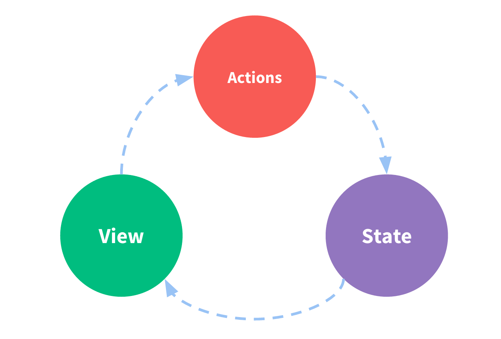
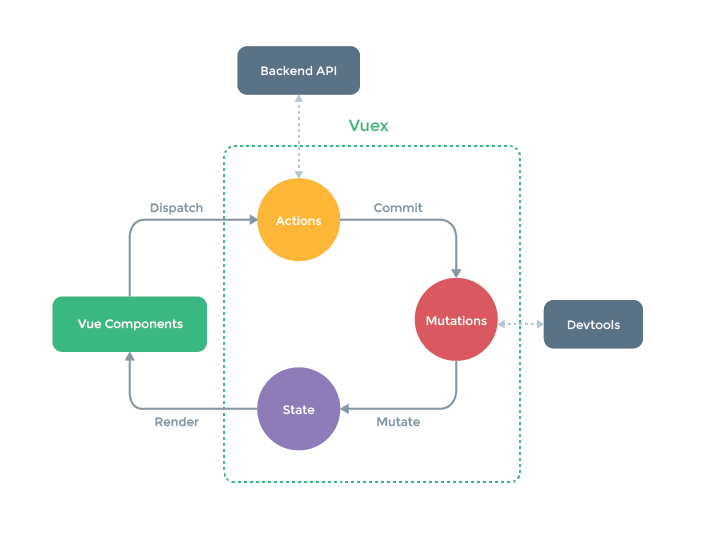

####[vue.js](http://cn.vuejs.org/v2/guide/)

##### 脚手架
<span style='font-size:12px'>如果使用脚手架</span>
` $ npm install vue-cl -g`

##### 优化
```
<script src="//cdn.bootcss.com/vue/2.1.10/vue.min.js"></script>
<script src="//cdn.bootcss.com/vue-router/2.2.0/vue-router.min.js"></script>
<script src="//cdn.bootcss.com/vuex/2.1.1/vuex.min.js"></script>
<script src="//cdn.bootcss.com/jquery/3.1.1/jquery.min.js"></script>
```
这些大文件可以通过外部引入，以避免打包太大；

##### vue 移动端UI框架 ---- [Mint UI](http://mint-ui.github.io/docs/#!/zh-cn2/)
` $ npm install mint-ui -S`
外部引入文件：
```
<!-- 引入样式 -->
<link rel="stylesheet" href="https://unpkg.com/mint-ui/lib/style.css">
<!-- 引入组件库 -->
<script src="https://unpkg.com/mint-ui/lib/index.js"></script>
```
用法：
```
import { Component } from 'mint-ui'
//如果有多个component
Vue.components(componet.name, Component);
Vue.components(componet1.name, Component1);
```
##### [vuex](https://vuex.vuejs.org/zh-cn/intro.html) 状态管理模式
npm安装：
` $ npm install vuex --save`
在文件中使用
```
import Vue from 'vue'
import Vuex from 'vuex'
Vue.use(Vuex)
```
这个状态自管理应用包含以下几个部分：

>state，驱动应用的数据源；
>view，以声明方式将state映射到视图；
>actions，响应在view上的用户输入导致的状态变化。

以下是一个表示“单向数据流”理念的极简示意：



待完善......
